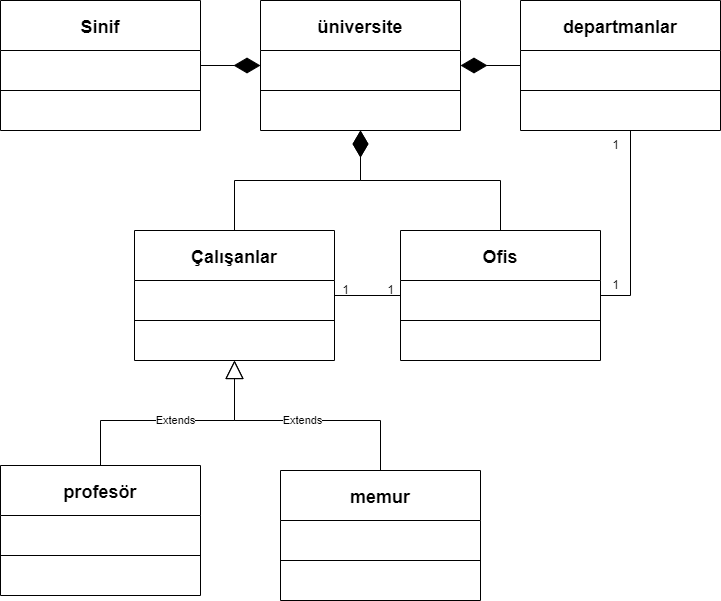

#  Üniversite Yönetim Sistemi

* Üniversiteye ait sınıflıklar, çalışma ofisleri ve departmanlar vardır.
* Departmanlara ait ofisler vardır.
* Üniversiteye ait çalışanlar vardır. Bu çalışanlar profesör veya memur olabilir.
* Her çalışan bir ofiste çalışır.

_Not : Sınıflara ait nitelik ve davranışların belirtilmesine gerek yoktur._

## Diyagram

